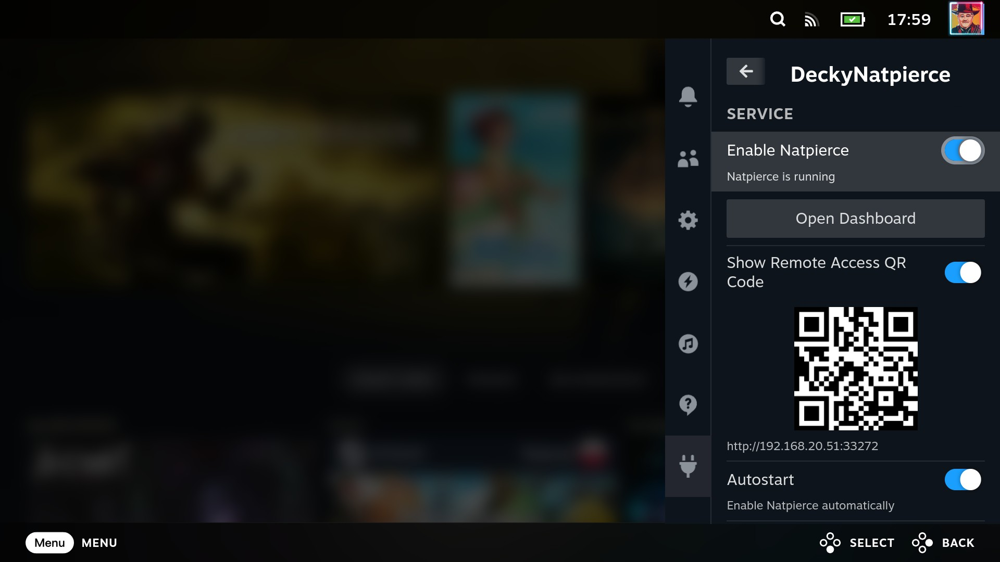

# Decky Natpierce
EN | [中文](README_CN.md)

Decky plugin for [Natpierce](https://www.natpierce.cn).

True point-to-point direct connection for internal network penetration.

|                               |
| ----------------------------- |
|  |

## Installation

1. Download the latest release from [Releases](https://github.com/honjow/decky-natpierce/releases/latest)
2. Copy the `decky-natpierce.zip` file to your handheld device
3. Enable developer mode in the decky loader settings
4. Install the plugin from the decky loader

## Credits

- [Natpierce](https://www.natpierce.cn)
- [Decky Loader](https://github.com/SteamDeckHomebrew/decky-loader)
- [DeckyClash](https://github.com/chenx-dust/DeckyClash)